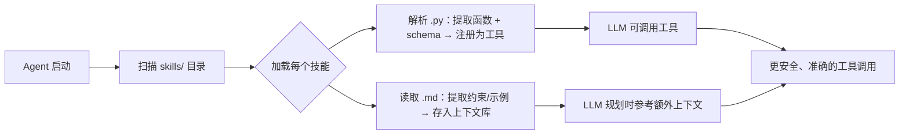

```mermaid
graph LR
    A[Agent 启动] --> B[扫描 skills/ 目录]
    B --> C{加载每个技能}
    C --> D[解析 .py：提取函数 + schema → 注册为工具]
    C --> E[读取 .md：提取约束/示例 → 存入上下文库]
    D --> F[LLM 可调用工具]
    E --> G[LLM 规划时参考额外上下文]
    F & G --> H[更安全、准确的工具调用]
```