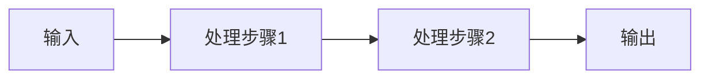

# 概念解释模板

> 📅 创建日期：YYYY-MM-DD  
> 🏷️ 标签：#基础概念 #算法 #理论 #实践

## 📋 基本信息

- **概念名称**：[概念中英文名称]
- **所属领域**：[机器学习/深度学习/NLP/CV等]
- **难度等级**：⭐⭐⭐ (1-5星)
- **前置知识**：[需要了解的基础知识]

---

## 🎯 一句话解释

> [用一句话通俗解释这个概念是什么]

---

## 📖 详细说明

### 定义
[给出准确定义，包括数学定义或算法定义]

### 核心思想
[解释概念背后的核心原理和动机]

### 工作原理


---

## 🧮 数学基础

### 相关公式
- **核心公式**：
  $$f(x) = \int_{-\infty}^{x} \frac{1}{\sqrt{2\pi}\sigma} e^{-\frac{(t-\mu)^2}{2\sigma^2}} dt$$

- **推导过程**：
  [详细说明公式如何推导得出]

### 参数说明
| 参数 | 符号 | 含义 | 取值范围 |
|------|------|------|----------|
| 均值 | μ | 分布中心 | (-∞, +∞) |
| 标准差 | σ | 分布离散程度 | (0, +∞) |

---

## 💻 代码实现

### Python实现
```python
import numpy as np

def concept_implementation(data, param1, param2):
    """
    实现概念的函数
    
    Args:
        data: 输入数据
        param1: 参数1说明
        param2: 参数2说明
    
    Returns:
        处理结果
    """
    # 核心算法实现
    result = data * param1 + param2
    return result

# 使用示例
if __name__ == "__main__":
    data = np.array([1, 2, 3, 4, 5])
    result = concept_implementation(data, param1=2, param2=1)
    print(f"结果: {result}")
```

### 关键步骤说明
1. **步骤1**：[说明]
2. **步骤2**：[说明]
3. **步骤3**：[说明]

---

## 📊 应用场景

### 典型应用
1. **应用场景1**：[具体说明]
2. **应用场景2**：[具体说明]
3. **应用场景3**：[具体说明]

### 实际案例
[举一个具体的应用案例]

---

## 🔄 相关概念对比

| 概念 | 特点 | 优点 | 缺点 | 适用场景 |
|------|------|------|------|----------|
| **当前概念** | [特点] | [优点] | [缺点] | [场景] |
| 相关概念1 | [特点] | [优点] | [缺点] | [场景] |
| 相关概念2 | [特点] | [优点] | [缺点] | [场景] |

---

## 🤔 常见问题

### Q1: [常见问题1]
**A**: [详细解答]

### Q2: [常见问题2]
**A**: [详细解答]

### Q3: [常见问题3]
**A**: [详细解答]

---

## 💡 学习技巧

### 理解要点
1. [重点1]
2. [重点2]
3. [重点3]

### 记忆方法
[提供记忆这个概念的技巧或方法]

### 练习建议
- [练习类型1]
- [练习类型2]
- [练习类型3]

---

## 🔗 扩展阅读

### 经典论文
- [论文1]：[简介]
- [论文2]：[简介]

### 优质教程
- [教程1]：[链接]
- [教程2]：[链接]

### 视频资源
- [视频1]：[链接]
- [视频2]：[链接]

---

## 📝 个人笔记

> [记录学习过程中的思考、疑问和insights]

### 理解难点
[记录最难理解的部分和如何克服]

### 实践心得
[记录实际应用中的经验和教训]

### 思考延伸
[基于这个概念的进一步思考和联想]

---

**掌握程度**：[初步理解/基本掌握/熟练应用]  
**复习时间**：[设置复习提醒]  
**相关笔记**：[链接到其他相关笔记]