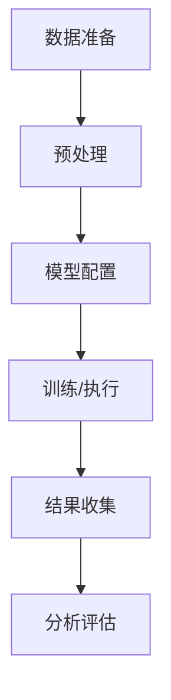

# 实验记录模板

> 🧪 实验编号：EXP-[YYYYMMDD]-[序号]  
> 📅 实验日期：YYYY-MM-DD  
> 🏷️ 标签：#实验 #验证 #调优 #研究

## 📋 实验概述

### 实验目的
[清晰说明本次实验要验证什么假设或回答什么问题]

### 实验假设
H₀: [零假设 - 通常表示无效果或无差异]  
H₁: [备择假设 - 期望验证的假设]

### 实验设计
- **实验类型**：[对照实验/A-B测试/参数调优/方法对比]
- **自变量**：[操作的变量]
- **因变量**：[观察的指标]
- **控制变量**：[保持不变的参数]

---

## 🔧 实验设置

### 环境配置
- **硬件**：[CPU/GPU/内存配置]
- **软件**：[操作系统/编程语言版本]
- **框架**：[TensorFlow/PyTorch版本等]

### 数据集
| 数据集 | 大小 | 用途 | 特点 |
|--------|------|------|------|
| [数据集1] | [样本数] | [训练/验证/测试] | [描述] |
| [数据集2] | [样本数] | [训练/验证/测试] | [描述] |

### 实验组设置
| 组别 | 配置 | 说明 |
|------|------|------|
| 基准组 | [基准配置] | [对照组设置] |
| 实验组1 | [配置1] | [实验变量1] |
| 实验组2 | [配置2] | [实验变量2] |

---

## 📊 实验过程

### 实验步骤


### 详细记录

#### Step 1: 数据准备 (时间: HH:MM - HH:MM)
- **操作**：[具体操作]
- **结果**：[输出结果]
- **问题**：[遇到的问题]

#### Step 2: 模型配置 (时间: HH:MM - HH:MM)
- **配置参数**：
  ```python
  config = {
      "learning_rate": 0.001,
      "batch_size": 32,
      "epochs": 100,
      "hidden_units": [128, 64, 32]
  }
  ```

#### Step 3: 训练过程 (时间: HH:MM - HH:MM)
- **训练日志**：
  ```
  Epoch 1/100 - loss: 0.8234 - val_loss: 0.7621
  Epoch 10/100 - loss: 0.4231 - val_loss: 0.3987
  ...
  ```

---

## 📈 实验结果

### 定量结果
| 指标 | 基准组 | 实验组1 | 实验组2 | 改进幅度 |
|------|--------|---------|---------|----------|
| 准确率 | 85.2% | 87.8% | 89.3% | +4.1% |
| 精确率 | 83.1% | 85.6% | 87.2% | +4.1% |
| 召回率 | 87.5% | 89.2% | 90.1% | +2.6% |
| F1分数 | 85.2% | 87.4% | 88.6% | +3.4% |
| 训练时间 | 45min | 48min | 52min | +15.6% |

### 可视化结果


### 统计显著性
- **t检验结果**：t(df) = [值], p = [p值]
- **置信区间**：95% CI [[下限], [上限]]
- **效应量**：Cohen's d = [效应量值]

---

## 🧮 结果分析

### 主要发现
1. **发现1**：[实验组1相比基准组提升了X%]
2. **发现2**：[实验组2在Y指标上表现最佳]
3. **发现3**：[某个参数对结果影响显著]

### 假设验证
- **H₀是否被拒绝**：[是/否]
- **统计显著性**：[p < 0.05，具有统计显著性]
- **实际意义**：[改进幅度是否具有实际应用价值]

### 异常分析
- **异常值**：[识别到的异常数据点]
- **原因分析**：[可能导致异常的原因]
- **处理方式**：[如何处理这些异常]

---

## 💡 讨论与反思

### 实验成功之处
1. [成功的方面1]
2. [成功的方面2]
3. [成功的方面3]

### 存在的问题
1. **问题1**：[描述]
   - **影响**：[对结果的影响]
   - **改进建议**：[如何改进]

2. **问题2**：[描述]
   - **影响**：[对结果的影响]
   - **改进建议**：[如何改进]

### 局限性
1. [局限性1]
2. [局限性2]
3. [局限性3]

---

## 🔄 后续实验计划

### 立即跟进
- [ ] [下一步实验1]
- [ ] [下一步实验2]

### 长期规划
- [ ] [长期计划1]
- [ ] [长期计划2]

### 待验证假设
1. [新假设1]
2. [新假设2]

---

## 📝 实验日志

### 关键决策记录
- **时间**：YYYY-MM-DD HH:MM
- **决策**：[做出的重要决策]
- **原因**：[决策的原因]
- **影响**：[决策的影响]

### 代码变更记录
```bash
# 主要代码修改
git commit -m "exp: add experiment config for hyperparameter tuning"
```

---

## 🔗 相关资源

- **实验代码**：[代码链接或路径]
- **数据集**：[数据链接或路径]
- **环境配置**：[requirements.txt或Dockerfile]
- **相关实验**：
  - [实验1]
  - [实验2]

---

**实验状态**：[完成/进行中/暂停]  
**结论有效性**：[强/中/弱]  
**下次实验时间**：[计划时间]  
**相关笔记**：[链接到其他相关笔记]