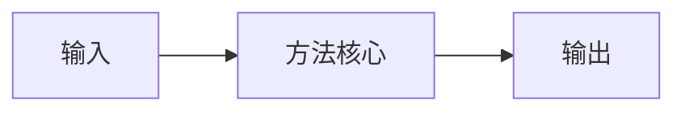

# 论文笔记模板

> 📅 阅读日期：YYYY-MM-DD  
> 🔗 论文链接：[DOI或ArXiv链接]  
> 🏷️ 标签：#类别 #算法 #应用领域

## 📋 基本信息

- **标题**：[论文标题]
- **作者**：[作者列表]
- **发表会议/期刊**：[会议/期刊名称] [年份]
- **关键词**：[关键词1, 关键词2, 关键词3]

---

## 📖 摘要总结

> [用自己的话简述论文核心贡献和创新点]

---

## 🎯 研究问题

### 问题描述
- [具体说明要解决的问题]
- [现有方法的局限性]
- [为什么这个问题重要]

### 主要贡献
1. [贡献点1]
2. [贡献点2]
3. [贡献点3]

---

## 🔧 方法论

### 核心思想


### 关键算法
```python
# 伪代码或核心算法描述
def algorithm():
    # 主要步骤
    pass
```

### 数学公式
- **目标函数**：
  $$L(\theta) = \sum_{i=1}^{n} \ell(f_\theta(x_i), y_i)$$

- **约束条件**：
  $$s.t. \quad \theta \in \Theta$$

---

## 📊 实验与结果

### 数据集
- [数据集1]：[描述]
- [数据集2]：[描述]

### 评价指标
- [指标1]：[说明]
- [指标2]：[说明]

### 主要结果
| 方法 | 数据集1 | 数据集2 | 平均 |
|------|---------|---------|------|
| Baseline | 85.2% | 78.9% | 82.1% |
| 本文方法 | **89.7%** | **84.3%** | **87.0%** |

---

## 💡 个人思考

### 优点
1. [优点1]
2. [优点2]
3. [优点3]

### 局限性
1. [局限性1]
2. [局限性2]
3. [局限性3]

### 延伸思考
- [可能的改进方向]
- [可以结合的其他方法]
- [实际应用场景]

---

## 🔗 相关资源

- **论文PDF**：[链接]
- **代码实现**：[GitHub链接]
- **相关论文**：
  - [引用1]
  - [引用2]
- **博客解析**：[链接]

---

## 📝 学习笔记

> [记录阅读过程中的疑问、理解和insights]

---

**下次复习时间**：[设置复习提醒]  
**相关笔记**：[链接到其他相关笔记]