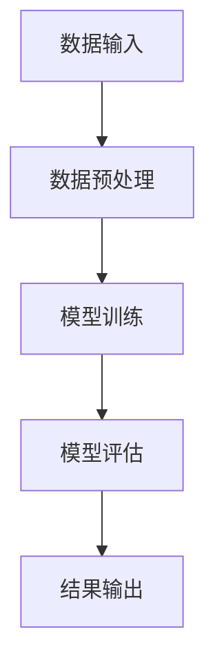

# 项目记录模板

> 🚀 开始日期：YYYY-MM-DD  
> 🏁 完成日期：[进行中/已完成]  
> 🏷️ 项目类型：#学习项目 #原创项目 #比赛项目 #研究项目

## 📋 项目概述

### 项目名称
[项目名称]

### 项目目标
- [主要目标1]
- [主要目标2]
- [主要目标3]

### 背景与动机
[为什么要做这个项目，解决了什么问题]

---

## 🎯 技术方案

### 技术栈
- **编程语言**：[Python, JavaScript, etc.]
- **框架库**：[TensorFlow, PyTorch, Scikit-learn, etc.]
- **工具平台**：[Jupyter, Docker, AWS, etc.]

### 架构设计


### 核心算法
[描述主要算法和实现思路]

---

## 📝 开发日志

### Phase 1: 需求分析与设计 (YYYY-MM-DD - YYYY-MM-DD)

#### ✅ 已完成
- [x] [任务1]
- [x] [任务2]

#### 🔄 进行中
- [ ] [任务3]
- [ ] [任务4]

#### ❌ 遇到的问题
1. **问题描述**：[具体问题]
   - **解决方案**：[如何解决的]
   - **经验教训**：[学到了什么]

### Phase 2: 核心功能开发 (YYYY-MM-DD - YYYY-MM-DD)

[继续记录各阶段的进展]

---

## 📊 实验结果

### 性能指标
| 指标 | 目标值 | 实际值 | 达成度 |
|------|--------|--------|--------|
| 准确率 | >90% | 92.3% | ✅ |
| 召回率 | >85% | 87.1% | ✅ |
| F1分数 | >88% | 89.6% | ✅ |

### 结果可视化


### 与基线方法对比
| 方法 | 准确率 | 速度 | 资源消耗 |
|------|--------|------|----------|
| 基线1 | 85.2% | 1.2s | 高 |
| 基线2 | 87.8% | 0.8s | 中 |
| **本项目** | **92.3%** | **0.6s** | **低** |

---

## 🧪 代码实现

### 核心代码片段
```python
# 关键实现
class MyModel:
    def __init__(self):
        pass
    
    def train(self, data):
        # 训练逻辑
        pass
```

### 项目结构
```
project-name/
├── data/           # 数据文件
├── src/            # 源代码
├── notebooks/      # 实验记录
├── tests/          # 测试代码
└── README.md       # 项目说明
```

---

## 💡 经验总结

### 技术收获
1. [学到的技术点1]
2. [学到的技术点2]
3. [学到的技术点3]

### 遇到的坑
1. [问题1] - [解决方法]
2. [问题2] - [解决方法]

### 改进方向
1. [可以优化的地方1]
2. [可以优化的地方2]

---

## 🔗 相关资源

- **代码仓库**：[GitHub链接]
- **数据集**：[数据集链接]
- **参考文档**：
  - [文档1]
  - [文档2]
- **相关项目**：
  - [项目1]
  - [项目2]

---

## 📈 后续计划

### 短期目标 (1-2周)
- [ ] [任务1]
- [ ] [任务2]

### 长期目标 (1-3个月)
- [ ] [任务1]
- [ ] [任务2]

---

**项目状态**：[进行中/已完成/暂停]  
**最后更新**：YYYY-MM-DD  
**相关笔记**：[链接到其他相关笔记]