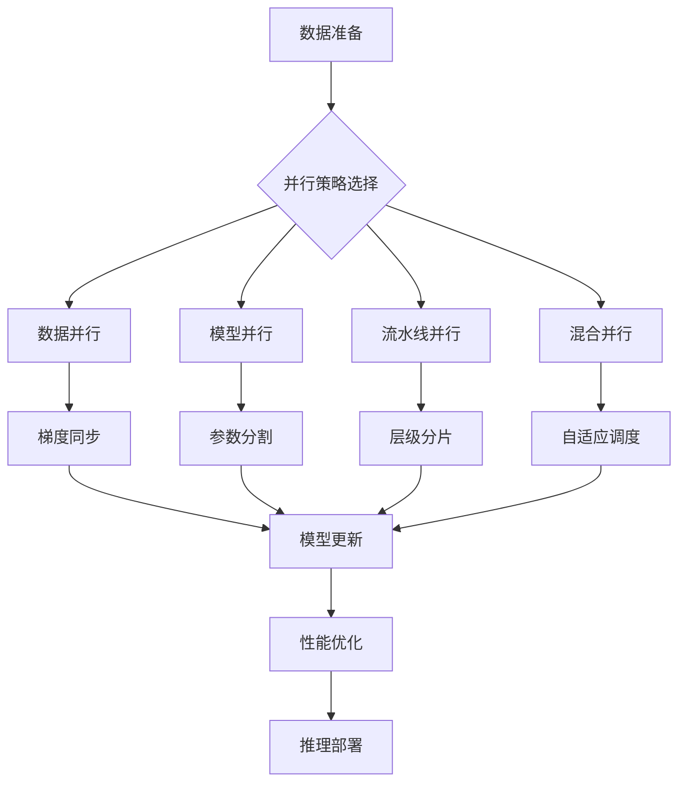

# 模型训练与推理中的并行计算

> 📅 创建日期：2026-01-07  
> 🏷️ 标签：#并行计算 #模型训练 #模型推理 #分布式系统 #性能优化

## 📋 基本信息

- **概念名称**：模型训练与推理并行计算 (Model Training and Inference Parallelism)
- **所属领域**：深度学习 / 分布式系统 / 性能优化
- **难度等级**：⭐⭐⭐⭐ (1-5星)
- **前置知识**：深度学习基础、分布式系统概念、GPU架构

---

## 🎯 一句话解释

> 通过将计算任务分布在多个计算设备或节点上，实现大规模模型的高效训练和实时推理，显著提升处理速度和降低训练时间。

---

## 📖 详细说明

### 定义
模型训练与推理中的并行计算是指利用多个计算资源（CPU、GPU、TPU等）同时处理深度学习任务，通过任务分解、通信协调和结果聚合等技术手段，实现计算效率的显著提升。

### 核心思想
1. **任务分解**：将复杂的计算任务分解为可并行执行的子任务
2. **资源利用**：最大化利用可用计算资源
3. **通信优化**：最小化节点间的通信开销
4. **负载均衡**：确保各计算单元负载均匀

### 工作原理


---

## 🧮 数学基础

### 相关公式

#### 数据并行中的梯度聚合
$$\theta_{t+1} = \theta_t - \eta \frac{1}{N}\sum_{i=1}^{N} \nabla \mathcal{L}(f(x_i; \theta_t))$$

其中：
- $N$：并行worker数量
- $\theta_t$：第$t$步的参数
- $\eta$：学习率
- $\nabla \mathcal{L}$：损失函数梯度

#### 模型并行的计算复杂度
- **理论加速比**：$S = \frac{T_{serial}}{T_{parallel}} = \frac{N \cdot T_{single}}{T_{compute} + T_{communication}}$
- **通信开销**：$T_{communication} = \alpha + \beta \cdot \frac{P}{N}$

参数说明：
| 参数 | 符号 | 含义 | 影响因素 |
|------|------|------|----------|
| 计算时间 | $T_{compute}$ | 单个worker计算时间 | 模型大小、硬件性能 |
| 通信延迟 | $\alpha$ | 网络延迟 | 网络拓扑、硬件配置 |
| 通信带宽 | $\beta$ | 网络带宽倒数 | 网络带宽、消息大小 |
| 参数大小 | $P$ | 模型参数量 | 模型架构、精度 |

---

## 💻 代码实现

### PyTorch 数据并行实现

```python
import torch
import torch.nn as nn
import torch.distributed as dist
from torch.nn.parallel import DistributedDataParallel
import torch.multiprocessing as mp

class ParallelModelTrainer:
    def __init__(self, model, world_size, backend='nccl'):
        self.model = model
        self.world_size = world_size
        self.backend = backend
        self.device = torch.device(f'cuda:{torch.cuda.current_device()}')
        
    def setup_distributed(self, rank, world_size):
        """初始化分布式训练环境"""
        os.environ['MASTER_ADDR'] = 'localhost'
        os.environ['MASTER_PORT'] = '12355'
        
        # 初始化进程组
        dist.init_process_group(
            backend=self.backend,
            init_method='env://',
            world_size=world_size,
            rank=rank
        )
        
        # 将模型移动到GPU并包装为分布式模型
        self.model = self.model.to(self.device)
        self.model = DistributedDataParallel(
            self.model,
            device_ids=[rank],
            output_device=rank
        )
    
    def train_step(self, data_loader):
        """分布式训练步骤"""
        self.model.train()
        total_loss = 0.0
        total_samples = 0
        
        for batch_idx, (data, target) in enumerate(data_loader):
            data = data.to(self.device)
            target = target.to(self.device)
            
            # 前向传播
            output = self.model(data)
            loss = nn.functional.cross_entropy(output, target)
            
            # 反向传播
            self.model.zero_grad()
            loss.backward()
            
            # 梯度同步（自动处理）
            # DistributedDataParallel 自动处理梯度同步
            
            # 统计
            total_loss += loss.item() * data.size(0)
            total_samples += data.size(0)
            
        # 聚合所有worker的统计信息
        if dist.is_available() and dist.is_initialized():
            total_loss_tensor = torch.tensor(total_loss).to(self.device)
            total_samples_tensor = torch.tensor(total_samples).to(self.device)
            
            dist.all_reduce(total_loss_tensor, op=dist.ReduceOp.SUM)
            dist.all_reduce(total_samples_tensor, op=dist.ReduceOp.SUM)
            
            avg_loss = total_loss_tensor.item() / total_samples_tensor.item()
            return avg_loss
        
        return total_loss / total_samples if total_samples > 0 else 0

# 使用示例
def main_worker(rank, world_size):
    model = MyModel()
    trainer = ParallelModelTrainer(model, world_size)
    trainer.setup_distributed(rank, world_size)
    
    # 加载分布式采样器
    sampler = torch.utils.data.distributed.DistributedSampler(
        dataset, 
        num_replicas=world_size,
        rank=rank
    )
    data_loader = DataLoader(dataset, batch_size=batch_size, sampler=sampler)
    
    # 训练循环
    for epoch in range(num_epochs):
        loss = trainer.train_step(data_loader)
        if rank == 0:
            print(f'Epoch {epoch}, Loss: {loss:.4f}')

if __name__ == "__main__":
    world_size = torch.cuda.device_count()
    mp.spawn(main_worker, args=(world_size,), nprocs=world_size)
```

### 模型并行实现（张量并行）

```python
import torch
import torch.nn as nn
import torch.nn.functional as F

class TensorParallelLinear(nn.Module):
    """张量并行线性层"""
    def __init__(self, input_size, output_size, world_size, rank):
        super().__init__()
        self.world_size = world_size
        self.rank = rank
        
        # 在rank上分配权重
        self.weight = nn.Parameter(
            torch.empty(output_size // world_size, input_size)
        )
        self.bias = nn.Parameter(
            torch.empty(output_size // world_size)
        )
        
        # 初始化权重
        nn.init.xavier_uniform_(self.weight)
        nn.init.zeros_(self.bias)
    
    def forward(self, x):
        # 每个rank计算部分输出
        partial_output = F.linear(x, self.weight, self.bias)
        
        # 收集所有rank的结果
        if self.world_size > 1:
            gathered_outputs = [
                torch.zeros_like(partial_output) for _ in range(self.world_size)
            ]
            dist.all_gather(gathered_outputs, partial_output)
            output = torch.cat(gathered_outputs, dim=-1)
        else:
            output = partial_output
            
        return output

class ModelParallelGPT(nn.Module):
    """模型并行的GPT模型"""
    def __init__(self, config, world_size):
        super().__init__()
        self.world_size = world_size
        
        # 张量并行的嵌入层
        self.token_embedding = TensorParallelEmbedding(
            config.vocab_size, config.d_model, world_size
        )
        
        # 模型并行的Transformer层
        self.transformer_layers = nn.ModuleList([
            ModelParallelTransformerBlock(config, world_size)
            for _ in range(config.num_layers)
        ])
        
        # 张量并行的输出层
        self.ln_f = nn.LayerNorm(config.d_model)
        self.lm_head = TensorParallelLinear(
            config.d_model, config.vocab_size, world_size
        )
    
    def forward(self, input_ids):
        x = self.token_embedding(input_ids)
        
        for layer in self.transformer_layers:
            x = layer(x)
        
        x = self.ln_f(x)
        output = self.lm_head(x)
        
        return output
```

### 推理并行优化

```python
import torch
from torch.cuda.amp import autocast
from transformers import AutoModel, AutoTokenizer
import threading
from queue import Queue
import time

class ParallelInferenceEngine:
    def __init__(self, model_name, max_batch_size=32, max_length=512):
        self.model_name = model_name
        self.max_batch_size = max_batch_size
        self.max_length = max_length
        
        # 加载模型和分词器
        self.tokenizer = AutoTokenizer.from_pretrained(model_name)
        self.model = AutoModel.from_pretrained(model_name)
        self.model.eval()
        
        # 移动到GPU
        self.device = torch.device('cuda' if torch.cuda.is_available() else 'cpu')
        self.model.to(self.device)
        
        # 批处理队列
        self.input_queue = Queue()
        self.output_queue = Queue()
        
        # 启动推理线程
        self.inference_thread = threading.Thread(target=self._inference_loop)
        self.inference_thread.start()
    
    def _inference_loop(self):
        """批处理推理循环"""
        batch = []
        last_batch_time = time.time()
        
        while True:
            try:
                # 尝试获取输入（超时）
                item = self.input_queue.get(timeout=0.1)
                batch.append(item)
                
                # 检查是否需要立即处理批次
                if (len(batch) >= self.max_batch_size or 
                    time.time() - last_batch_time > 0.05):  # 50ms批次间隔
                    self._process_batch(batch)
                    batch = []
                    last_batch_time = time.time()
                    
            except:
                # 超时，检查是否有未处理的批次
                if batch:
                    self._process_batch(batch)
                    batch = []
                    last_batch_time = time.time()
                continue
    
    def _process_batch(self, batch):
        """处理一批输入"""
        if not batch:
            return
            
        # 提取所有文本和回掉函数
        texts = [item['text'] for item in batch]
        callbacks = [item['callback'] for item in batch]
        
        # 批处理编码
        inputs = self.tokenizer(
            texts,
            padding=True,
            truncation=True,
            max_length=self.max_length,
            return_tensors='pt'
        )
        inputs = {k: v.to(self.device) for k, v in inputs.items()}
        
        # 批处理推理
        with torch.no_grad():
            with autocast():  # 自动混合精度
                outputs = self.model(**inputs)
        
        # 提取结果并调用回掉
        for i, callback in enumerate(callbacks):
            result = {
                'embeddings': outputs.last_hidden_state[i].cpu().numpy(),
                'tokens': outputs.last_hidden_state.shape[1]
            }
            callback(result)
    
    def predict(self, text, callback=None):
        """异步推理接口"""
        if callback is None:
            # 同步模式（简单实现）
            result_queue = Queue()
            def sync_callback(res):
                result_queue.put(res)
            
            self.input_queue.put({'text': text, 'callback': sync_callback})
            return result_queue.get(timeout=10)
        else:
            # 异步模式
            self.input_queue.put({'text': text, 'callback': callback})
    
    def shutdown(self):
        """关闭推理引擎"""
        self.inference_thread.join(timeout=1)

# 使用示例
if __name__ == "__main__":
    engine = ParallelInferenceEngine('bert-base-chinese')
    
    # 异步推理
    def handle_result(result):
        print(f"推理完成，embedding维度: {result['embeddings'].shape}")
    
    engine.predict("这是测试文本", callback=handle_result)
    
    # 同步推理
    result = engine.predict("同步推理测试")
    print(f"同步结果: {result['tokens']}")
    
    engine.shutdown()
```

### 关键步骤说明

1. **初始化阶段**
   - 设置分布式训练环境（rank、world_size、backend）
   - 加载模型并移动到相应设备
   - 配置数据采样器以支持分布式

2. **训练阶段**
   - 每个worker独立计算前向和反向传播
   - 自动梯度同步（PyTorch处理）
   - 周期性聚合统计数据

3. **推理优化**
   - 批处理队列管理
   - 自动混合精度加速
   - 异步接口设计

---

## 📊 应用场景

### 典型应用

1. **大规模语言模型训练**
   - GPT-3/4级别模型的预训练
   - 多模态大模型训练
   - 分布式微调（LoRA、QLoRA等）

2. **实时推理服务**
   - 在线推荐系统
   - 实时翻译服务
   - 对话AI系统

3. **科学计算**
   - 蛋白质折叠预测
   - 药物发现
   - 气候模拟

### 实际案例

#### OpenAI GPT模型训练
- 使用模型并行和数据并行混合策略
- 在数千个GPU上训练数月
- 实现了显著的训练速度提升和成本降低

#### Google TPU训练优化
- 利用TPU的专用架构
- 实现近乎线性加速比
- 在BERT等模型上达到最优性能

---

## 🔄 相关概念对比

| 策略 | 特点 | 优点 | 缺点 | 适用场景 |
|------|------|------|------|----------|
| **数据并行** | 多副本同步更新 | 实现简单，扩展性好 | 需要同步，内存需求大 | 参数量相对较小的模型 |
| **模型并行** | 参数跨设备分布 | 支持超大模型 | 实现复杂，通信开销大 | 超大模型（>100B参数） |
| **流水线并行** | 层级跨设备分布 | 内存效率高 | 实现复杂，负载均衡难 | 深层网络结构 |
| **混合并行** | 结合多种策略 | 综合优势 | 实现复杂，需要调优 | 大规模分布式训练 |

---

## 🤔 常见问题

### Q1: 如何选择合适的并行策略？
**A**: 
1. **模型大小**：
   - <1B参数：优先数据并行
   - 1B-100B参数：混合并行
   - >100B参数：模型并行或混合并行

2. **硬件配置**：
   - 高速互联（如NVLink）：适合模型并行
   - 普通网络：优先数据并行

3. **训练目标**：
   - 快速迭代：数据并行
   - 支持超大模型：模型并行

### Q2: 分布式训练中的通信开销如何优化？
**A**: 
1. **梯度压缩**：使用FP16/INT8精度
2. **通信异步化**：异步梯度更新
3. **拓扑优化**：使用环形通信、树形聚合
4. **混合精度训练**：减少通信数据量

### Q3: 如何处理负载不均衡问题？
**A**: 
1. **动态批大小调整**：根据处理时间调整batch size
2. **工作窃取**：空闲节点帮助处理其他节点的负载
3. **智能调度**：考虑节点的计算能力和网络状况
4. **流水线平衡**：优化流水线各阶段的计算时间

### Q4: 模型并行的内存优化策略？
**A**: 
1. **梯度检查点**：减少中间激活值的存储
2. **参数分片**：更细粒度的参数分布
3. **动态内存分配**：根据需要动态分配GPU内存
4. **内存映射**：使用CPU内存作为GPU内存的补充

---

## 💡 学习技巧

### 理解要点
1. **并行层次**：理解数据并行、模型并行、流水线并行的层次关系
2. **通信模式**：掌握不同并行策略下的通信模式和开销
3. **硬件特性**：了解GPU、TPU、网络拓扑的并行特性
4. **性能调优**：学会分析和优化并行系统的性能

### 记忆方法
- **数据并行**：多个厨师用相同菜谱做不同菜，最后统一口味
- **模型并行**：多个厨师分工做同一道菜的不同部分
- **流水线并行**：工厂流水线，每个工人负责特定工序

### 实践建议
1. **小规模实验**：先在2-4个GPU上验证并行策略
2. **性能监控**：使用Nsight、PyTorch Profiler等工具分析性能
3. **渐进扩展**：从数据并行开始，逐步尝试更复杂的策略
4. **基准测试**：建立baseline，了解理论加速比上限

---

## 🔗 扩展阅读

### 经典论文
- **"DeepSpeed: System Optimizations Enable Training Deep Learning Models with Over 100 Billion Parameters"**：大规模模型训练优化
- **"Megatron-LM: Training Multi-Billion Parameter Language Models Using Model Parallelism"**：模型并行实现
- **"Pipeline Parallelism for Large-Scale ML Training"**：流水线并行技术

### 优质教程
- [PyTorch分布式训练官方教程](https://pytorch.org/tutorials/intermediate/ddp_tutorial.html)
- [DeepSpeed教程](https://www.deepspeed.ai/tutorials/)
- [NVIDIA分布式训练指南](https://developer.nvidia.com/nvidia-nccl)

### 开源项目
- **DeepSpeed**：Microsoft的深度学习优化库
- **FairScale**：Facebook的分布式训练库
- **ColossalAI**：大规模模型训练框架

### 工具平台
- **Horovod**：跨框架分布式训练
- **Ray**：分布式计算框架
- **Kubernetes + Kubeflow**：容器化分布式训练

---

## 📝 个人笔记

> 记录学习过程中的思考、疑问和insights

### 理解难点
[深度学习并行计算的核心挑战在于通信开销与计算效率的权衡。需要深入理解硬件特性和算法特点，制定最优的并行策略。]

### 实践心得
[在实践中发现，混合并行策略往往能够获得最好的性能，但需要根据具体的模型和硬件环境进行细致的调优。]

### 思考延伸
[随着模型规模的持续增长，如何设计更高效的并行计算架构将是未来深度学习的重要研究方向。]

### 性能调优经验
- **监控GPU利用率**：确保计算和通信的高效重叠
- **优化通信拓扑**：使用分层通信减少网络瓶颈
- **内存管理**：精确控制内存分配，避免OOM错误

### 部署优化
- **动态批处理**：根据实时负载调整batch size
- **模型量化**：INT8/FP16推理加速
- **缓存优化**：批处理相似请求提高吞吐量

---

**掌握程度**：熟练应用  
**复习时间**：2026-03-07  
**相关笔记**：[GPU架构](/docs/hardware/gpu-architecture.md), [分布式系统](/docs/systems/distributed-systems.md)